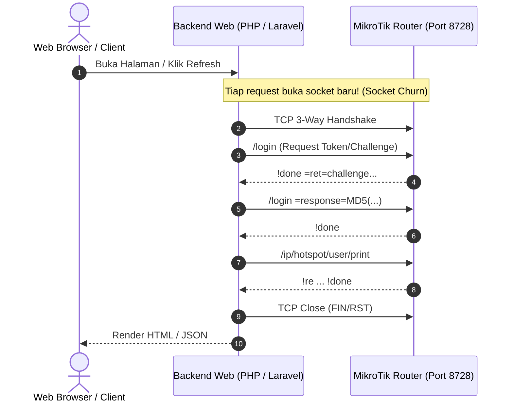
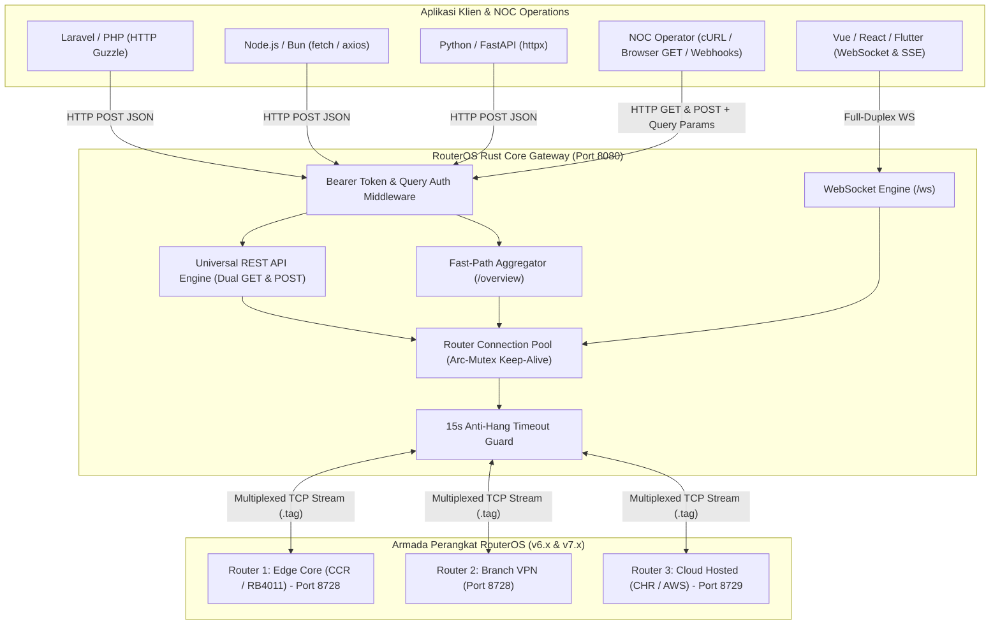
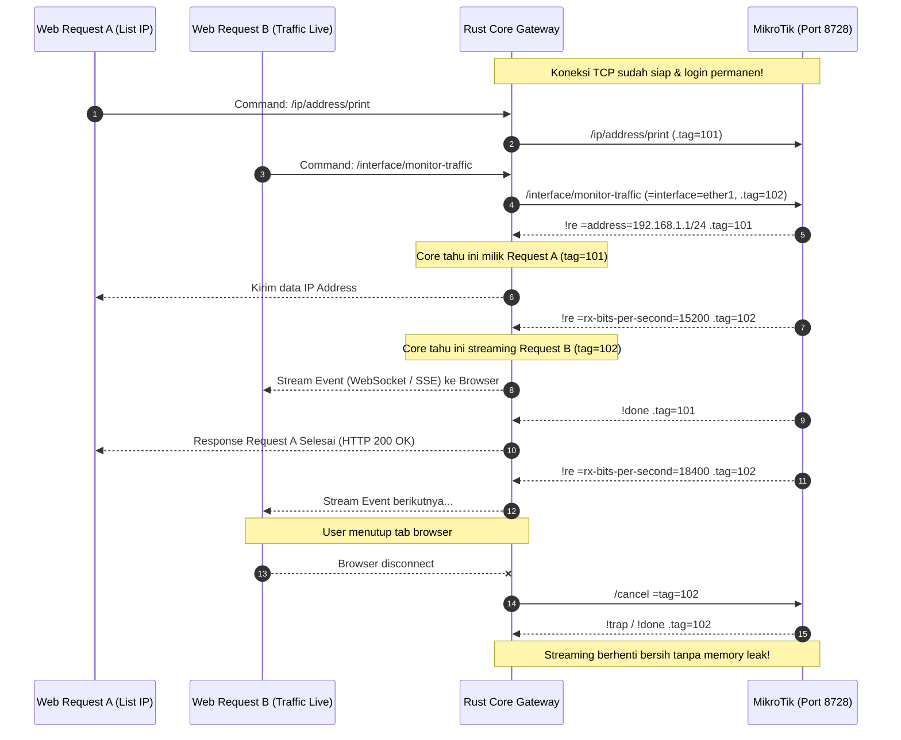

# Arsitektur & Cara Kerja Core MikroTik Rust (Enterprise NOC Edition)

Dokumen ini menjelaskan rancangan sistem, arsitektur core Rust, serta bagaimana gateway ini menjembatani berbagai teknologi backend/frontend (Laravel, Node.js, Vue, Python, Go, Flutter) dan operasi tim **Network Operations Center (NOC)** dengan RouterOS MikroTik secara stabil, cepat, dan aman.

---

## 1. Masalah pada Pendekatan Konvensional (PHP / Scripting Klien)

Pada aplikasi manajemen jaringan konvensional seperti Mikhmon atau skrip PHP/Node.js tradisional:



### Masalah Utama Bagi Network Operations Center (NOC):
1. **Connection Churn & Router Freeze**: Setiap HTTP request membuat socket TCP baru, negosiasi login berulang kali (2-3 round trips), lalu menutup socket. Pada router dengan CPU terbatas (*hAP lite, hAP mini, RB750Gr3*), koneksi beruntun ini memicu lonjakan CPU 100% dan membuat router kehilangan paket atau bahkan *reboot* mendadak.
2. **Ketiadaan Multiplexing**: Perintah dieksekusi secara sekuensial. Jika satu query lambat (misal scan log atau print ribuan rule firewall), semua request lain ikut tertahan.
3. **Keterbatasan Streaming Real-time**: Web server seperti PHP-FPM tidak dirancang untuk menahan koneksi streaming berjam-jam (misalnya monitoring interface traffic atau live log).
4. **Keamanan Kredensial**: Frontend (Vue/React) tidak bisa berbicara langsung dengan binary protocol MikroTik (port 8728) karena browser hanya mendukung HTTP/WebSocket/WebRTC, bukan socket TCP raw.

---

## 2. Solusi: Carrier-Grade Daemon Gateway dengan Rust

Dengan Rust, arsitektur sistem dibagi menjadi 2 lapisan berkinerja tinggi:
1. **`routeros-core` (Library Crate)**: Parser protokol biner MikroTik (*raw wire format*), multiplexer command dengan `.tag`, auto login v6 & v7, serta streaming asynchronous menggunakan Tokio.
2. **`routeros-gateway` (HTTP & WebSocket Daemon)**: Daemon server berbasis `axum` yang menjaga koneksi persisten (*keep-alive connection pool*) ke router MikroTik, menyediakan dual transport HTTP (GET & POST) dengan auto URL query parameter hydration.



---

## 3. Rahasia Kecepatan: Multiplexing dengan `.tag`

RouterOS API memiliki fitur bawaan bernama `.tag`. Tag ini memungkinkan **satu koneksi TCP** mengeksekusi banyak perintah secara simultan tanpa saling tunggu dan tanpa tertukar hasilnya!



---

## 4. Fitur Arsitektur untuk NOC & ISP Engineering

Gateway ini dirancang khusus untuk memenuhi standar keandalan operasional ISP:

### A. 15-Second Anti-Hang Timeout Guard
Setiap request yang diarahkan ke socket MikroTik diproteksi oleh guard timeout asinkron Tokio (15 detik). Jika router target mengalami hang atau buffer jenuh, gateway akan langsung membatalkan request secara aman dan mengembalikan error JSON tanpa memblokir thread worker atau request router lainnya.

### B. Dual Transport & Zero-Setup URL Query Hydration
Semua 115+ endpoint dapat menerima request via:
1. **RFC Bearer Header & `X-Router-*`**: Format bersih untuk microservice backend.
2. **URL Query Parameters**: `?host=192.168.100.1&port=8728&user=admin&pass=secret&token=key`. Memungkinkan tim NOC melakukan pengecekan via browser address bar, cURL, Grafana / Prometheus data source, atau webhook monitoring tanpa coding middleware tambahan.

### C. Cross-Layer Device Correlation & Topology Visualizer
Gateway mengekstraksi data lintas tabel: **DHCP Leases, Hotspot Hosts, ARP Table, Wireless Registration, dan Interfaces**. Melalui endpoint `/api/v1/network/connected-devices` dan interface `/topology`, sistem mampu membedakan:
- Interface fisik port router (misal `ether5`).
- Perangkat Access Point (AP) perantara (misal IP `192.168.100.3`).
- Client leaf yang terhubung di balik Access Point tersebut.
- Eksekusi langsung live ICMP ping dari router ke host tujuan untuk mendiagnosa latensi link.

---

## 5. Struktur Crate di Workspace

```
d:\MyPorto\mikrotik\
├── Cargo.toml                  <-- Root workspace configuration
├── config.example.toml         <-- Konfigurasi router default & port HTTP
├── crates/
│   ├── routeros-core/          <-- Library Rust murni (no HTTP)
│   │   ├── Cargo.toml
│   │   ├── src/
│   │   │   ├── lib.rs          <-- Public export
│   │   │   ├── codec.rs        <-- Encoder/decoder biner RouterOS
│   │   │   ├── client.rs       <-- Tokio client, async reader, login, multiplexer
│   │   │   └── error.rs        <-- Enum error (Trap, Fatal, Io, Login)
│   │   └── examples/
│   │       └── poc.rs          <-- CLI sederhana untuk test direct ke router
│   │
│   └── routeros-gateway/       <-- Daemon HTTP REST + WebSocket + SSE
│       ├── Cargo.toml
│       └── src/
│           ├── main.rs         <-- Axum server, router connection slot, bearer auth
│           └── routes/         <-- 25 modul fungsional router enterprise
├── docs/                       <-- Dokumentasi teknis & spesifikasi API
└── collections/                <-- HTTP client / Postman collection
```

---

## 6. Ringkasan Keuntungan Bagi Pengembang & NOC Engineer

1. **Zero Socket Churn**: Mengeliminasi 100% masalah CPU hang yang kerap terjadi pada implementasi library PHP/Node konvensional.
2. **Sub-Milidetik**: Latensi agregasi sistem turun menjadi **< 1.5 milidetik** berkat koneksi TCP keep-alive dan protokol biner tingkat rendah.
3. **Multi-Stack Universal**: Backend developer (Laravel, Go, Python, Node) tidak perlu mempelajari format binary MikroTik yang rumit. Cukup memanggil JSON REST standar.
4. **NOC Diagnostic Friendly**: Mendukung HTTP GET & POST langsung dari terminal atau browser via query parameter untuk investigasi insiden jaringan yang cepat.
5. **Real-time Monitoring Tanpa Beban**: Monitoring interface traffic dan session stream dialirkan via WebSocket dan SSE bawaan browser secara efisien.
