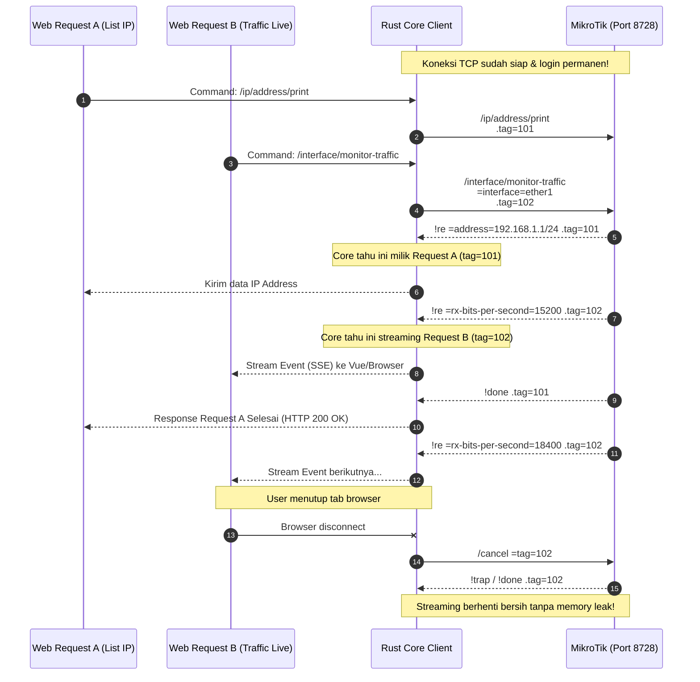

# Arsitektur & Cara Kerja Core MikroTik Rust

Dokumen ini menjelaskan rancangan sistem, arsitektur core Rust, serta bagaimana gateway ini menjembatani berbagai teknologi backend/frontend (Laravel, Node.js, Vue, Python, Go) dengan RouterOS MikroTik.

---

## 1. Masalah pada Pendekatan Konvensional (PHP / Scripting Klien)

Pada aplikasi seperti Mikhmon atau skrip PHP/Node.js tradisional:


### Masalah Utama:
1. **Connection Churn & Overhead**: Setiap HTTP request dari user membuat socket TCP baru, negosiasi login berulang kali (2-3 round trips), lalu menutup socket. Ini membebani CPU MikroTik yang umumnya terbatas.
2. **Keterbatasan Streaming Real-time**: Web server seperti PHP-FPM tidak dirancang untuk menahan koneksi streaming berjam-jam (misalnya monitoring interface traffic atau log live).
3. **Keamanan Kredensial**: Frontend (Vue/React) tidak bisa berbicara langsung dengan binary protocol MikroTik (port 8728) karena browser hanya mendukung HTTP/WebSocket/WebRTC, bukan socket TCP raw.

---

## 2. Solusi: Daemon Gateway dengan Rust

Dengan Rust, kita membagi sistem menjadi 2 lapisan:
1. **`routeros-core` (Library Crate)**: Parser protokol biner, multiplexer command dengan `.tag`, auto login v6 & v7, serta streaming asynchronous menggunakan Tokio.
2. **`routeros-gateway` (HTTP & SSE Daemon)**: Daemon server berbasis `axum` yang menjaga koneksi persisten (*keep-alive connection pool*) ke router MikroTik.

```mermaid
graph TB
    subgraph Clients ["Aplikasi Klien (Bebas Bahasa / Framework)"]
        LV["Laravel / PHP<br/>(HTTP Guzzle)"]
        ND["Node.js / Bun<br/>(fetch / axios)"]
        PY["Python / Django / FastAPI<br/>(httpx)"]
        VU["Vue / React / Svelte<br/>(EventSource SSE)"]
    end

    subgraph RustGateway ["RouterOS Rust Core Gateway (Port 8080)"]
        AUTH["Bearer Token Auth"]
        ROUTER_SLOT["Router Connection Pool<br/>(Arc&lt;Slot&gt; per Router)"]
        HTTP_HANDLER["REST API Handler<br/>(/routers/:id/command)"]
        SSE_HANDLER["SSE Stream Handler<br/>(/routers/:id/listen)"]
    end

    subgraph MikrotikEnv ["Router MikroTik"]
        MT1["Router 1 (v6 / v7)<br/>Port 8728 (API)"]
        MT2["Router 2 (CHR / Cloud)<br/>Port 8728 (API)"]
    end

    LV -->|POST JSON| AUTH
    ND -->|POST JSON| AUTH
    PY -->|POST JSON| AUTH
    VU -->|GET EventSource (Realtime)| AUTH

    AUTH --> HTTP_HANDLER
    AUTH --> SSE_HANDLER

    HTTP_HANDLER --> ROUTER_SLOT
    SSE_HANDLER --> ROUTER_SLOT

    ROUTER_SLOT <===>|Multiplexed TCP Socket (Persistent)| MT1
    ROUTER_SLOT <===>|Multiplexed TCP Socket (Persistent)| MT2
```

---

## 3. Rahasia Kecepatan: Multiplexing dengan `.tag`

RouterOS API memiliki fitur native bernama `.tag`. Tag ini memungkinkan **satu koneksi TCP** mengeksekusi banyak perintah secara simultan tanpa saling tunggu dan tanpa tertukar hasilnya!



---

## 4. Struktur Crate di Workspace

```
d:\MyPorto\mikrotik\
├── Cargo.toml                  <-- Root workspace configuration
├── config.example.toml         <-- Konfigurasi router & port HTTP
├── crates/
│   ├── routeros-core/          <-- Library Rust murni (no HTTP)
│   │   ├── Cargo.toml
│   │   ├── src/
│   │   │   ├── lib.rs          <-- Public export
│   │   │   ├── codec.rs        <-- Encoder/decoder biner RouterOS
│   │   │   ├── client.rs       <-- Tokio client, async reader, login, multiplexer
│   │   │   └── error.rs        <-- Enum error (Trap, Fatal, Io, Login)
│   │   └── examples/
│   │       └── poc.rs          <-- CLI sederhana untuk test direct ke router
│   │
│   └── routeros-gateway/       <-- Daemon HTTP REST + Server-Sent Events (SSE)
│       ├── Cargo.toml
│       └── src/
│           └── main.rs         <-- Axum server, router connection slot, bearer auth
├── docs/                       <-- Panduan teknis lengkap
└── collections/                <-- HTTP client / Postman collection
```

---

## 5. Ringkasan Keuntungan untuk Developer

1. **Multi-stack Ready**: Backend developer tidak perlu pusing mempelajari format binary MikroTik yang rumit. Cukup gunakan `fetch()` atau `Http::post()` standar JSON.
2. **Koneksi Selalu Hangat (Zero Handshake Overhead)**: Latency pemanggilan data MikroTik turun drastis karena socket TCP sudah terbuka dan terotentikasi.
3. **Aman untuk Frontend**: Frontend tidak perlu menyimpan password MikroTik. Password tersimpan di `config.toml` server Rust di jaringan internal.
4. **Realtime Ringan**: Fitur dashboard live traffic langsung jalan lewat browser menggunakan SSE standar bawaan HTML5 (`new EventSource()`).
