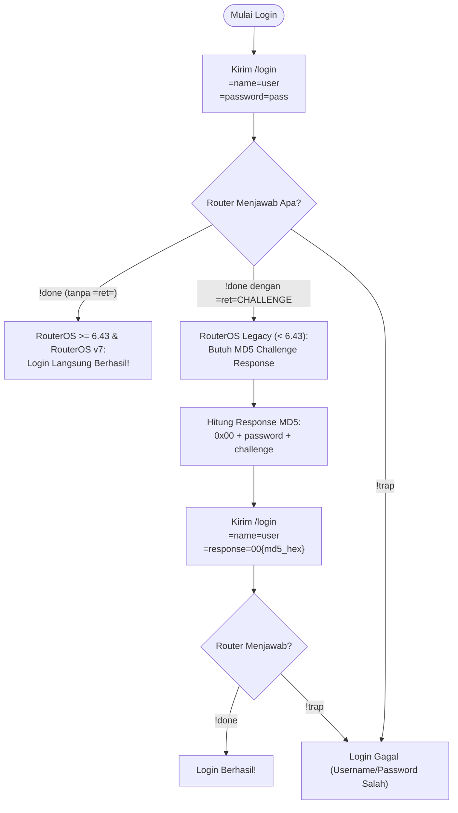

# Protokol Biner RouterOS API (Port 8728 / 8729)

Dokumen ini menjelaskan spesifikasi protokol tingkat rendah (*low-level wire format*) yang diimplementasikan pada file [`crates/routeros-core/src/codec.rs`](file:///d:/MyPorto/mikrotik/crates/routeros-core/src/codec.rs).

---

## 1. Konsep Dasar Wire Format

MikroTik API tidak menggunakan JSON atau format teks berbasis newline standar. Protokol ini berbasis:
- **Word**: Sebaris teks atau data biner yang diawali dengan *Length Prefix* (panjang kata dalam byte).
- **Sentence**: Sekumpulan *Word* yang diakhiri dengan sebuah *Word* dengan panjang 0 byte (`0x00`).

```
+---------------+---------------+---------------+ ... +---------------+------+
| Length Prefix | Word 1        | Length Prefix | ... | Word N        | 0x00 |
+---------------+---------------+---------------+ ... +---------------+------+
|<------------- Word 1 -------->|<------------- Word 2 -------------->| Akhir Sentence
```

---

## 2. Format Length Prefix (Variabel 1 - 5 Byte)

Panjang kata di-encode secara efisien menggunakan skema bit flag pada byte pertama:

| Nilai Panjang (`len`) | Jumlah Byte | Skema Bit Byte Pertama | Contoh Byte |
|---|---|---|---|
| `0 <= len < 128` (0x80) | 1 byte | `0xxxxxxx` | Misal 5 -> `0x05` |
| `128 <= len < 16,384` (0x4000) | 2 byte | `10xxxxxx` + 1 byte | Misal 200 -> `0x80 0xC8` |
| `16,384 <= len < 2,097,152` | 3 byte | `110xxxxx` + 2 byte | Bit flag `0xC0` |
| `2,097,152 <= len < 268,435,456` | 4 byte | `1110xxxx` + 3 byte | Bit flag `0xE0` |
| `>= 268,435,456` | 5 byte | Byte pertama `0xF0` + 4 byte nilai mentah | `0xF0 [B1] [B2] [B3] [B4]` |

Implementasi ini ada di fungsi [`encode_len`](file:///d:/MyPorto/mikrotik/crates/routeros-core/src/codec.rs) dan [`decode_len`](file:///d:/MyPorto/mikrotik/crates/routeros-core/src/codec.rs).

---

## 3. Jenis Word dalam Perintah (Command)

Saat klien mengirim perintah ke MikroTik, terdapat beberapa tipe format string:

1. **Command Word**: Diawali tanda `/`
   - Contoh: `/ip/address/print`, `/system/reboot`
2. **Attribute Word**: Diawali tanda `=`
   - Format: `=nama_parameter=nilai`
   - Contoh: `=interface=ether1`, `=comment=Hotspot Gateway`
3. **Query Word (Filter)**: Diawali tanda `?`
   - Format: `?properti=nilai` (sama dengan), `?#properti` (ada), `?-properti` (tidak ada)
   - Contoh: `?disabled=no`, `?dynamic=true`
4. **API Control Word**: Diawali tanda `.`
   - `.tag=123`: ID penanda sesi command untuk multiplexing.
   - `.proplist=name,address,network`: Membatasi kolom yang dikembalikan router agar menghemat CPU & bandwidth.

---

## 4. Jenis Balasan dari Router (Reply Sentences)

Setiap balasan dari router selalu dimulai dengan word pertama yang menentukan tipe balasan:

| Tipe Balasan | Simbol | Arti |
|---|---|---|
| **Data Record** | `!re` | Satu baris data hasil query (berisi atribut `=key=value`). |
| **Selesai Sukses** | `!done` | Perintah selesai dieksekusi secara sukses. Dapat memiliki atribut return `=ret=...`. |
| **Error / Ditolak** | `!trap` | Perintah gagal dieksekusi oleh router (misal hak akses kurang atau item tidak ditemukan). Disertai `=message=...` dan opsional `=category=...`. |
| **Koneksi Putus** | `!fatal` | Terjadi kesalahan fatal pada level sesi, koneksi akan langsung ditutup oleh router. |

---

## 5. Mekanisme Login: RouterOS v6 vs v7

Perilaku login MikroTik mengalami evolusi penting yang diantisipasi secara otomatis oleh core Rust:



Kode deteksi otomatis ini terletak di method `login` pada [`crates/routeros-core/src/client.rs`](file:///d:/MyPorto/mikrotik/crates/routeros-core/src/client.rs#L140-L167).
Dengan implementasi ini, core Rust kompatibel dengan router lawas maupun RouterOS v7 terbaru tanpa perlu konfigurasi terpisah.
