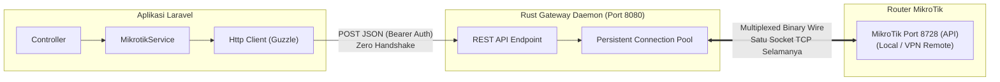

# Panduan Integrasi Lengkap Laravel ke MikroTik via Rust Gateway

Dokumen ini memandu Anda menghubungkan aplikasi **Laravel** ke **MikroTik RouterOS** menggunakan daemon Rust Gateway. Semua fitur MikroTik (Hotspot, Voucher, PPPoE, IP Address, Interface, DHCP, Queue/Bandwidth, Firewall, Resource) dapat dipanggil melalui method siap pakai.

---

## 1. Arsitektur Komunikasi



### Keuntungan untuk Laravel:
1. **Request Cepat (Sub-millisecond latency)**: Controller Laravel tidak perlu lagi melakukan TCP 3-way handshake dan login hashing MD5 ke MikroTik di setiap klik user. Koneksi TCP ke router sudah dijaga tetap hidup (*warm connection*) oleh Rust.
2. **Tidak Mengunci Worker PHP-FPM**: Eksekusi perintah diproses sangat cepat oleh Rust lalu langsung dikembalikan ke Laravel dalam format array JSON bersih.
3. **Data Aman**: Jika terjadi error (misalnya user voucher sudah ada), Rust mengembalikan status HTTP 422 dengan pesan error asli dari MikroTik (`!trap`), sehingga Laravel dapat menangkapnya dalam `try-catch`.

---

## 2. Langkah Setup di Laravel

### Langkah 1: Tambahkan Konfigurasi di `.env`
Buka file `.env` di proyek Laravel Anda:
```env
MIKROTIK_GATEWAY_URL=http://127.0.0.1:8080
MIKROTIK_GATEWAY_TOKEN=change-me-to-a-long-random-string
MIKROTIK_DEFAULT_ROUTER=main
```

### Langkah 2: Daftarkan di `config/services.php`
Buka file `config/services.php` dan tambahkan blok berikut:
```php
'mikrotik' => [
    'gateway_url' => env('MIKROTIK_GATEWAY_URL', 'http://127.0.0.1:8080'),
    'token' => env('MIKROTIK_GATEWAY_TOKEN'),
    'default_router' => env('MIKROTIK_DEFAULT_ROUTER', 'main'),
],
```

---

## 3. Class Service Siap Pakai: `app/Services/MikrotikService.php`

Buat file baru di `app/Services/MikrotikService.php`:

```php
<?php

namespace App\Services;

use Illuminate\Support\Facades\Http;
use Exception;

class MikrotikService
{
    protected string $baseUrl;
    protected string $token;
    protected string $defaultRouter;

    public function __construct()
    {
        $this->baseUrl = config('services.mikrotik.gateway_url');
        $this->token = config('services.mikrotik.token');
        $this->defaultRouter = config('services.mikrotik.default_router', 'main');
    }

    /**
     * Core Runner: Menjalankan command arbitrary ke MikroTik
     *
     * @param string $command Path command MikroTik (contoh: '/ip/address/print')
     * @param array $args Parameter, filter query, atau proplist
     * @param string|null $routerId ID router di config.toml (default: 'main')
     * @return array List data yang dikembalikan oleh MikroTik
     * @throws Exception
     */
    public function command(string $command, array $args = [], ?string $routerId = null): array
    {
        $router = $routerId ?? $this->defaultRouter;

        $response = Http::withToken($this->token)
            ->timeout(10)
            ->post("{$this->baseUrl}/routers/{$router}/command", [
                'command' => $command,
                'args' => (object) $args,
            ]);

        if ($response->failed()) {
            $err = $response->json('error') ?? $response->body();
            throw new Exception("MikroTik Error [{$response->status()}]: {$err}");
        }

        return $response->json();
    }

    // =========================================================================
    // 1. SYSTEM & RESOURCE MONITORING
    // =========================================================================

    /** Ambil CPU, Memory, Uptime, Versi RouterOS */
    public function getSystemResource(?string $router = null): array
    {
        $res = $this->command('/system/resource/print', [], $router);
        return $res[0] ?? [];
    }

    /** Ambil Model Router, Serial Number, Firmware */
    public function getRouterBoard(?string $router = null): array
    {
        $res = $this->command('/system/routerboard/print', [], $router);
        return $res[0] ?? [];
    }

    /** Ambil Nama Identitas Router */
    public function getIdentity(?string $router = null): string
    {
        $res = $this->command('/system/identity/print', [], $router);
        return $res[0]['name'] ?? 'MikroTik';
    }

    // =========================================================================
    // 2. INTERFACE & NETWORK
    // =========================================================================

    /** Ambil semua daftar interface jaringan */
    public function getInterfaces(?string $router = null): array
    {
        return $this->command('/interface/print', [
            '.proplist' => '.id,name,type,running,disabled,comment'
        ], $router);
    }

    /** Ambil semua alokasi IP Address */
    public function getIpAddresses(?string $router = null): array
    {
        return $this->command('/ip/address/print', [
            '.proplist' => '.id,address,network,interface,disabled'
        ], $router);
    }

    /** Tambah IP Address baru */
    public function addIpAddress(string $address, string $interface, ?string $comment = null, ?string $router = null): array
    {
        $args = ['address' => $address, 'interface' => $interface];
        if ($comment) $args['comment'] = $comment;
        return $this->command('/ip/address/add', $args, $router);
    }

    // =========================================================================
    // 3. HOTSPOT & VOUCHER MANAGEMENT (Mikhmon Style)
    // =========================================================================

    /** Ambil daftar profil paket hotspot */
    public function getHotspotProfiles(?string $router = null): array
    {
        return $this->command('/ip/hotspot/user/profile/print', [
            '.proplist' => '.id,name,rate-limit,shared-users'
        ], $router);
    }

    /** Ambil daftar semua user hotspot (voucher) */
    public function getHotspotUsers(?string $router = null): array
    {
        return $this->command('/ip/hotspot/user/print', [
            '.proplist' => '.id,name,profile,uptime,bytes-in,bytes-out,comment,disabled'
        ], $router);
    }

    /** Ambil daftar user hotspot yang SEDANG ONLINE saat ini */
    public function getActiveHotspotUsers(?string $router = null): array
    {
        return $this->command('/ip/hotspot/active/print', [
            '.proplist' => '.id,user,address,mac-address,uptime,bytes-in,bytes-out'
        ], $router);
    }

    /**
     * Buat User / Voucher Hotspot Baru
     */
    public function createHotspotUser(
        string $username,
        string $password,
        string $profile = 'default',
        ?string $timelimit = null,
        ?string $datalimit = null,
        ?string $comment = null,
        ?string $router = null
    ): array {
        $args = [
            'name' => $username,
            'password' => $password,
            'profile' => $profile,
        ];
        if ($timelimit) $args['limit-uptime'] = $timelimit;       // contoh: '1h', '30d'
        if ($datalimit) $args['limit-bytes-total'] = $datalimit;   // dalam byte, misal: '1073741824' (1GB)
        if ($comment)   $args['comment'] = $comment;

        return $this->command('/ip/hotspot/user/add', $args, $router);
    }

    /** Hapus User Hotspot berdasarkan .id */
    public function removeHotspotUser(string $id, ?string $router = null): array
    {
        return $this->command('/ip/hotspot/user/remove', ['.id' => $id], $router);
    }

    /** Putuskan koneksi user aktif (Kick user) */
    public function kickHotspotUser(string $activeId, ?string $router = null): array
    {
        return $this->command('/ip/hotspot/active/remove', ['.id' => $activeId], $router);
    }

    // =========================================================================
    // 4. PPPoE & VPN MANAGEMENT
    // =========================================================================

    /** Ambil daftar akun PPPoE Secret */
    public function getPppSecrets(?string $router = null): array
    {
        return $this->command('/ppp/secret/print', [
            '.proplist' => '.id,name,service,profile,remote-address,comment,disabled'
        ], $router);
    }

    /** Ambil user PPPoE yang sedang aktif terhubung */
    public function getActivePppConnections(?string $router = null): array
    {
        return $this->command('/ppp/active/print', [
            '.proplist' => '.id,name,service,caller-id,address,uptime'
        ], $router);
    }

    /** Buat akun PPPoE baru */
    public function createPppSecret(string $name, string $password, string $profile = 'default', string $service = 'pppoe', ?string $router = null): array
    {
        return $this->command('/ppp/secret/add', [
            'name' => $name,
            'password' => $password,
            'profile' => $profile,
            'service' => $service,
        ], $router);
    }

    // =========================================================================
    // 5. DHCP SERVER LEASES (Perangkat Lokal Terhubung)
    // =========================================================================

    /** Ambil daftar perangkat yang dapat IP DHCP */
    public function getDhcpLeases(?string $router = null): array
    {
        return $this->command('/ip/dhcp-server/lease/print', [
            '.proplist' => '.id,address,mac-address,host-name,status,expires-after,dynamic'
        ], $router);
    }

    /** Kunci IP perangkat DHCP menjadi Static IP */
    public function makeDhcpLeaseStatic(string $id, ?string $router = null): array
    {
        return $this->command('/ip/dhcp-server/lease/make-static', ['.id' => $id], $router);
    }

    // =========================================================================
    // 6. QUEUE / BANDWIDTH LIMIT
    // =========================================================================

    /** Ambil aturan Simple Queue */
    public function getSimpleQueues(?string $router = null): array
    {
        return $this->command('/queue/simple/print', [
            '.proplist' => '.id,name,target,max-limit,bytes'
        ], $router);
    }

    /** Buat Simple Queue Pembatas Bandwidth */
    public function addSimpleQueue(string $name, string $targetIp, string $maxUpload, string $maxDownload, ?string $router = null): array
    {
        return $this->command('/queue/simple/add', [
            'name' => $name,
            'target' => $targetIp,
            'max-limit' => "{$maxUpload}/{$maxDownload}", // contoh: '2M/10M'
        ], $router);
    }

    // =========================================================================
    // 7. FIREWALL & LOG
    // =========================================================================

    /** Ambil IP Address List (Filter / Drop) */
    public function getFirewallAddressLists(?string $router = null): array
    {
        return $this->command('/ip/firewall/address-list/print', [], $router);
    }

    /** Masukkan IP penyerang/pengguna ke Address List (Blokir) */
    public function blockIpAddress(string $ip, string $listName = 'BLOCKED_USERS', ?string $timeout = '1d', ?string $router = null): array
    {
        $args = [
            'address' => $ip,
            'list' => $listName,
        ];
        if ($timeout) $args['timeout'] = $timeout;
        return $this->command('/ip/firewall/address-list/add', $args, $router);
    }

    /** Ambil 20 baris log terakhir */
    public function getRecentLogs(int $limit = 20, ?string $router = null): array
    {
        return $this->command('/log/print', [], $router);
    }
}
```

---

## 4. Contoh Penggunaan di Controller Laravel

### A. Dashboard Monitoring Controller: `app/Http/Controllers/DashboardController.php`
```php
<?php

namespace App\Http\Controllers;

use App\Services\MikrotikService;
use Illuminate\Http\JsonResponse;

class DashboardController extends Controller
{
    public function index(MikrotikService $mt): JsonResponse
    {
        try {
            $resource = $mt->getSystemResource();
            $identity = $mt->getIdentity();
            $activeUsers = $mt->getActiveHotspotUsers();
            $dhcpCount = count($mt->getDhcpLeases());

            return response()->json([
                'success' => true,
                'router_name' => $identity,
                'cpu_load' => ($resource['cpu-load'] ?? 0) . '%',
                'uptime' => $resource['uptime'] ?? '-',
                'free_memory' => number_format(($resource['free-memory'] ?? 0) / 1024 / 1024, 2) . ' MB',
                'active_hotspot_count' => count($activeUsers),
                'total_dhcp_leases' => $dhcpCount,
            ]);
        } catch (\Exception $e) {
            return response()->json([
                'success' => false,
                'message' => $e->getMessage(),
            ], 500);
        }
    }
}
```

### B. Hotspot Voucher Controller: `app/Http/Controllers/HotspotController.php`
```php
<?php

namespace App\Http\Controllers;

use App\Services\MikrotikService;
use Illuminate\Http\Request;
use Illuminate\Http\JsonResponse;

class HotspotController extends Controller
{
    /** Daftar Voucher */
    public function index(MikrotikService $mt): JsonResponse
    {
        $users = $mt->getHotspotUsers();
        return response()->json($users);
    }

    /** Generate Voucher Baru */
    public function store(Request $request, MikrotikService $mt): JsonResponse
    {
        $request->validate([
            'username' => 'required|string',
            'password' => 'required|string',
            'profile' => 'required|string',
            'timelimit' => 'nullable|string', // misal: '3h', '1d'
        ]);

        try {
            $mt->createHotspotUser(
                $request->username,
                $request->password,
                $request->profile,
                $request->timelimit,
                null,
                'Dibuat via Laravel'
            );

            return response()->json([
                'success' => true,
                'message' => "Voucher {$request->username} berhasil dibuat!",
            ]);
        } catch (\Exception $e) {
            return response()->json([
                'success' => false,
                'error' => $e->getMessage(),
            ], 422);
        }
    }

    /** Hapus Voucher */
    public function destroy(string $id, MikrotikService $mt): JsonResponse
    {
        try {
            $mt->removeHotspotUser($id);
            return response()->json(['success' => true]);
        } catch (\Exception $e) {
            return response()->json(['success' => false, 'error' => $e->getMessage()], 422);
        }
    }
}
```

---

## 5. Menghubungkan ke Multiple Router (Multi-Router Support)

Jika Anda mengelola banyak cabang router (misal: Router Pusat, Router Cabang A, Router Hotspot Kafe), cukup tambahkan router-router tersebut di `config.toml` Rust Gateway:

```toml
[[router]]
id = "pusat"
addr = "192.168.1.1:8728"
user = "admin"
password = "passwordpusat"

[[router]]
id = "remote_vpn"
addr = "ath.vpnbersama.us:51121"
user = "admin"
password = "passwordremote"
```

Lalu di Laravel, Anda cukup mengoper parameter router ke method service:
```php
// Ambil hotspot dari router cabang VPN remote:
$users = $mt->getHotspotUsers('remote_vpn');

// Ambil resource dari router pusat:
$resource = $mt->getSystemResource('pusat');
```
Semuanya berjalan secara paralel, cepat, dan terisolasi tanpa saling tunggu!
